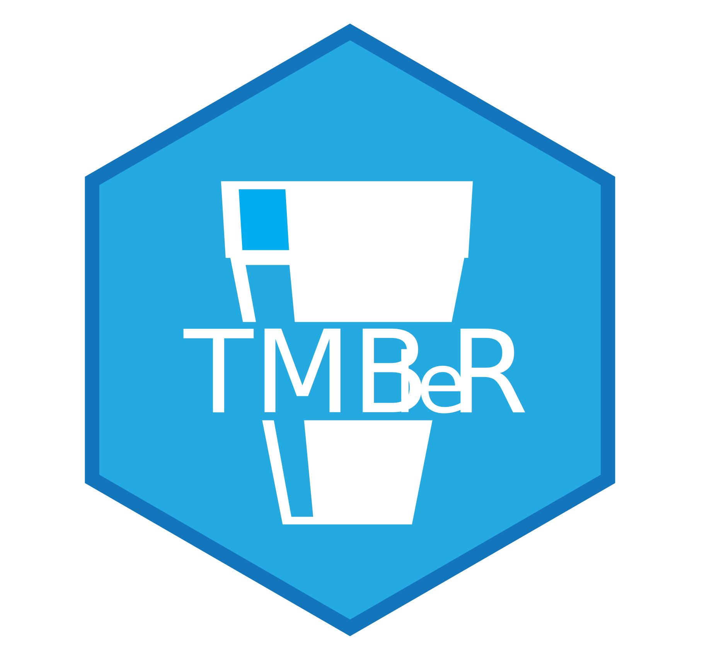

<p style="text-align: center;"></p>

# Tumor Mutational Burden (TMB) quantification

**Estimate the Tumor Mutational Burden in genomics sequencing efforts like WES and genomic panels.** 

 <p style="text-align: center;">[ [Github](https://github.com/acc-bioinfo/TMBleR) ] - [ [Website](https://acc-bioinfo.github.io/TMBleR/) ] - [ [Docker Image](https://hub.docker.com/repository/docker/aguida/tmbler) ] - [ [Demo webapp](https://bioserver.ieo.it/shiny/app/tmbler) ]
</p>

--- 

TMB has been proposed as a predictive biomarker for immunotherapy response in cancer patients, as it is thought to enrich for tumors with high neoantigen load. TMB assessed by Whole Exome Sequencing (WES) is considered the gold standard but remains confined to research settings. Targeted enrichment panels of various genomic sizes are emerging as a more sustainable methodology for assessing TMB in the clinical setting. However, panel-based sequencing inevitably leads to a nonrandom sampling of the total population of potential neoantigens. Thus, the choice of variant classes to be included in TMB calculation (e.g. synonymous mutations, mutations in cancer driver genes, low-allelic frequency mutations) may have a major impact on TMB quantification, its predictive power, and therefore its clinical utility. Significant efforts are being conducted to provide a standardized framework for TMB calculation.
TMBleR allows to streamline the TMB estimation process,  to precisely measure the impact of different variant filtering options on TMB quantification and, more importantly, on its predictive power, by using published datasets of immunotherapy-treated patients with available outcome data. 

We provide the community with a tool for maximizing the clinical impact of panel-based TMB measurement. 

---

## Getting started

TMBleR is available in different formats. 

* **demo**: If you only want to get a quick estimate of the TMB without having to install the software, have a look at the shiny web app available at the link [https://bioserver.ieo.it/shiny/app/tmbler](https://bioserver.ieo.it/shiny/app/tmbler). (**Note**, The app is not designed to support large computations with many samples). 
* As a **Docker image** ( See "Using TMBleR with no installation")
* As an **R package** (See "Install TMBleR as an R package")


## Using TMBleR with no installation

TMBleR is available as a docker container. This is the simplest way to get TMBleR to run

```
# Auth into the gitlab register
docker login docker.io
# Pull the latest docker image
docker pull aguida/tmbler:latest
# Run the container on port 8787
docker run \
    --name tmbler \
    --rm \
    -e USER=$(whoami) \
    -e PASSWORD=helloworld \
    -e USERID=$UID \
    -p 8787:8787 \
    -v $(pwd)/workdir \
    aguida/tmbler:latest
```

This will run a docker instance of TMBleR mounting your current directory into ```/workdir``` within the container, and 
opening port 8787 on your host machine, so that you can access RStudio interface through the browser by visiting 
http://localhost:8787 (username: your user, password: "helloworld")


## Install TMBleR as an R package
 
Prerequisites. TMBleR requires the following dependencies to be installed on your system:

* git lfs - [Install](https://git-lfs.github.com/)
* ImageMagick [Install](https://imagemagick.org/script/download.php)

Download the package with the git clone command:

```bash
git clone git@github.com:acc-bioinfo/TMBleR.git
# full all the large files
git lfs pull
```

Initiate R and install the R package using devtools (devtools needs to be installed as well)

```{r}
library("devtools")
devtools::install("TMBleR")
```


## Usage

To learn how to use TMBleR, please refer to the introductory vignette posted at this link: 

* [https://acc-bioinfo.github.io/TMBleR/articles/Introduction_to_TMBleR.html](https://acc-bioinfo.github.io/TMBleR/articles/Introduction_to_TMBleR.html)


