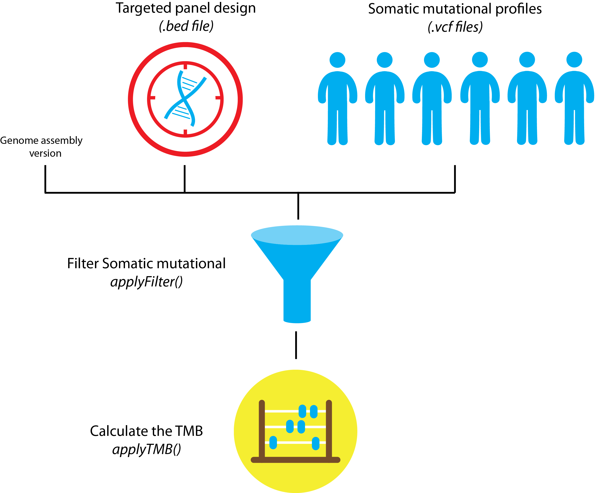

```{r setup, include = FALSE}
knitr::opts_chunk$set(collapse = TRUE, comment = "#>")
```

```{r style, echo = FALSE, results = 'asis'}
BiocStyle::markdown()
```
  
<style>
body {
text-align: justify}
</style>


Introduction
===============================================================================

_Tumor mutational burden_ (TMB), the total amount of somatic coding mutations in a tumor, represents a promising bio-marker to predict immunotherapy response in cancer patients. Initial studies investigating TMB used whole exome sequencing (WES) for quantification. Recently, it was demonstrated that TMB can be accurately measured also from targeted sequencing gene panels, which consistently reduces sequencing costs and paves the way for TMB routine adoption in clinical care. 
Currently, different sets of mutations are used to perform TMB quantification (e.g. only _non-synonymous mutations_, both _synonymous_ and _non-synonymous mutations_, all but known cancer mutations as they are over-represented in gene panels) and no common standard exists. This hampers fair comparison of results from different studies and different gene panels. 
**TMBleR allows to perform parallel panel-based TMB quantification by different combinations of variants filtering (e.g. synonymous, known cancer mutations, by VAF) and to easily plot estimated TMB values and visualize differences between methods and/or gene panels.**

```{r eval=FALSE, message=FALSE, include=TRUE}
library(TMBleR)
```

```{r message=FALSE, include=FALSE}
library(devtools)
devtools::load_all()
```


This package finds to following important applications:

* [Calculate the TMB for cancer patients undergoing genomic sequencing;](#partA)[^1]
* [Investigate how well the estimated TMB value from a genomic panel correlates to a whole exome sequencing (WES);](#partB)
* [Guide the design of a clinical genomics targeted panel by evaluate TMB performance to predict immunotherapy responders;](#partC)


[^1]: In the example showcased we are using targeted sequencing (specific group of genes), but the application of this package can be extended also to whole exome sequencing (WES).

  
TMB quantification using different filters {#partA}
================================================================================

In the example here provided, we want to perform TMB quantification of 2 different [Horizon cell lines](https://www.horizondiscovery.com) sequenced by a targeted gene panel[^horizon]. Different filters can be applied on the variants reported in the corresponding vcf files, prior to TMB quantification. Indeed, panel-based TMB quantification requires a method to extrapolate the number of mutations observed in the narrow sequencing space of gene panels to the whole exome. For this reason, _synonymous mutations_ can be counted for panel-based TMB quantification: although not immunogenic, they increase the statistical sampling size and reduce the noise. Besides panel size, gene composition also affects the accuracy of panel-based TMB quantification. In many gene panels, the over-representation of genes known to be highly mutated in cancers may lead to TMB overestimation. Therefore, some studies try to avoid this bias by removing somatic COSMIC variants or truncating mutations in tumor suppressors from variants used for TMB quantification. Other filters can be applied to variants for TMB quantification, such as minimum VAF thresholds.
No common standard currently exists and we apply here different filters and compare the obtained TMB.

[^horizon]: (Horizon, provides cell lines with a known mutational provide as well as the variant allele frequency (VAF). The samples in this example, are both characterized by mutations at 5% VAF; one of them was exposed to mild Formalin-fixed and paraffin-embedded (FFPE) treatment to reproduce the effects of DNA degradation typical of FFPE).



### Dataset preparation

There are 3 inputs required to perform the analysis:

- [Genome assemby](#genome-assembly) of reference: either "hg19" or "hg38";
- [Somatic mutations](#somatic-mutations-identified-by-the-gene-panel) identified by the gene panel, provided in vcf file format;
- [Panel design](#panel-design), provided as ```.bed``` file or ```.txt``` file with list of gene IDs.

Finally, in order for the package to work at his full potential, optionally you might want to provide the latest COMISC somatic pathogenic SNVs. This is optional and allows to use the ```remove.cancer``` filter option of applyFilter(). This will be discussed further below:

- [External dataset](#external-dataset-optional)  (Optional)

#### Genome assembly

Specify human assembly of reference, either "hg19" or "hg38".

```{r}
genome_assembly <- "hg19"
```

#### Somatic mutations identified by the gene panel

Read vcf files containing somatic variants identified by panel sequencing. 

```{r}
# Provide vcf_files as a list ---------------------------------
# Note that even when reading only one file you 
# need to provide it as a list with element name corresponding to the name to 
# give to the sample and value corresponding to the path to the file 
# (i.e. vcf_file=list(LungSample="inst/extdata/LungSample.vcf"))
vcf_files <- list(Horizon5="Horizon5_ExamplePanel.vcf", 
                  HorizonFFPEmild="HorizonFFPEmild_ExamplePanel.vcf")
# For each vcf file, get the absolute path. ------------------
# Here we are creating absolute paths by using .vcf files that were
# bundled with the package 
vcf_files <- lapply(vcf_files, function(x) 
  system.file("extdata", x, package = "TMBleR", mustWork = TRUE))
# read in the files -------------------------------------------
vcfs <- readVcfFiles(vcfFiles = vcf_files, assembly = genome_assembly)
```

#### Panel Design

Read in input the panel sequencing design (either a ```.bed``` file with 
genomic coordinates of the targeted genes or ```.txt``` file with targeted gene names).

```{r}
# Get absolute path
design_file_path = system.file( "extdata"
                        , "ExamplePanel_GeneIDs.txt"
                        , package = "TMBleR"
                        , mustWork = TRUE)

# Read bed file with the panel sequencing design 
design <- readDesign(
  filename = design_file_path
  , assembly = genome_assembly
  , ids = "entrezgene_id")

# Preview
head(design)
```

#### External dataset (Optional) 

External dataset are required for one of the mutation filters that removes known "cancer" mutation. This is achieved by setting ```remove.cancer = TRUE``` when calling ```applyFilter()``` (see section paragraph). Since these files are quite large, TMBleR comes with just a very small version that can be used to demo the package. If you are planning to use the ```remove.cancer``` filter, please see the vignette __HOWTO_Import_external_data__ which contains the instructions on how to retrieve the COSMIC data and import it into TMBleR. 

### Mutation filtering

Apply different filters on the identified variants. Typically, known cancer mutations are removed when performing panel-based TMB quantification, because the enrichment in cancer genes of these panels may lead to TMB overestimation.
Synonymous mutations instead are removed when using WES datasets (in principle they do not generate tumor neoepitopes), whereas they are kept when using panels to increase statistical sampling size and reduce noise.
Here we showcase how you can set up 7 different filtering combinations that will later on be used to estimate the TMB:


* Using an external dataset (downloaded from the Catalogue of Somatic Mutations in Cancer - COSMIC [https://cancer.sanger.ac.uk/cosmic](https://cancer.sanger.ac.uk/cosmic)) to filter for pathogenic SNV mutations (e.g coding mutations described in COSMIC and truncating mutations in tumor suppressor genes). This is achieved by setting ```remove.cancer = TRUE```;
* filter one or a combination of mutations classes:
  * "synonymous"
  * "non-synonymous"
  * "frameshift"
  * "nonsense"
  (Usage example: ```variantType = c("synonymous", "frameshift)```)
* Filer by Variant Allele Frequency (VAF), SNV with VAF lower than a specified threshold (defined by the ```vaf.cutoff``` argument) will be filtered out;
* a combination of all the above.

When setting ```remove.cancer = T```, TMBleR will filter out cancer mutation from the ```vcfs``` object. If you did not provide a cancer dataset, a demo dataset will be loaded instead and a warning message will be print out. 

**Note** the results here shown use a under-sampled vcf from the COSMIC file. This data are only for illustration purposes.

```{r warning=TRUE}
# Filter 1 ------------------------------------------------------------
# Remove known cancer mutations using COSMIC data
vcfs_NoCancer <- applyFilters(  vcfs = vcfs
                              , assembly = genome_assembly
                              , design = design
                              , remove.cancer = T)

# Filter 2 ------------------------------------------------------------
# Remove synonymous mutations
vcfs_NoSynonymous <- applyFilters(vcfs = vcfs, 
                                  assembly = genome_assembly, 
                                  design = design, 
                                  variantType = c("synonymous"))

# Filter 3 ------------------------------------------------------------
# Remove known cancer mutations and synonymous mutations
vcfs_NoCancer_NoSynonymous <- applyFilters(vcfs = vcfs, 
                                           assembly = genome_assembly,
                                           design = design, 
                                           remove.cancer = T, 
                                           variantType = c("synonymous"))

# Filter 4 ------------------------------------------------------------
# Remove synonymous mutations and mutations with variant 
# allele frequency < 0.05
vcfs_NoSynonymous_VAFFilter <- applyFilters(vcfs = vcfs, 
                                            assembly = genome_assembly, 
                                            design = design, 
                                            vaf.cutoff = 0.05, 
                                            variantType = c("synonymous"))

# Filter 5 ------------------------------------------------------------
# Remove mutations with variant allele frequency < 0.05
vcfs_VAFFilter <- applyFilters(
  vcfs = vcfs, 
  assembly = genome_assembly, 
  design = design, 
  vaf.cutoff = 0.05,
  tsList = NULL, 
)

# Filter 6 ------------------------------------------------------------
# Remove known cancer mutations (e.g. coding mutations described in COSMIC and 
# truncating mutations in tumor suppressor genes) and mutations with variant 
# allele frequency < 0.05
vcfs_NoCancer_VAFFilter <- applyFilters(
  vcfs = vcfs, 
  assembly = genome_assembly, 
  design = design, 
  vaf.cutoff = 0.05, 
  remove.cancer = T, 
)

# Filter 7 ------------------------------------------------------------
# Remove known cancer mutations (e.g. coding mutations described in COSMIC and 
# truncating mutations in tumor suppressor genes), synonymous mutations and 
# mutations with variant allele frequency < 0.05
vcfs_NoCancer_VAFFilter_NoSynonymous <- applyFilters(
  vcfs = vcfs, 
  assembly = genome_assembly, 
  design = design, 
  vaf.cutoff = 0.05, 
  remove.cancer = T, 
  variantType = c("synonymous")
)

# We also want to perform TMB quantification on a non filtered vcf. Therefore 
# we need to format it as required by the applyTMB function. We can 
# do so by simply providing no Filtering options
vcfs_nonfiltered <- applyFilters(
  vcfs = vcfs,
  assembly = genome_assembly, 
  design = design, 
)
```


### TMB quantification

The following command allows to estimate the TMB from the different filtering criteria chosen. 

```{r, fig.width=8, fig.height=6}
# Concatenate all filtered and unfiltered vcfs
vcfs_all <- c(vcfs_NoCancer, 
              vcfs_NoCancer_NoSynonymous, 
              vcfs_NoSynonymous, 
              vcfs_NoSynonymous_VAFFilter, 
              vcfs_VAFFilter, 
              vcfs_NoCancer_VAFFilter, 
              vcfs_NoCancer_VAFFilter_NoSynonymous, 
              vcfs_nonfiltered )

# Perform TMB quantification
TMB_res=applyTMB(inputForTMB = vcfs_all, assembly = genome_assembly)

# Print results in table format
DT::datatable(TMB_res)
```

The TMB estimate results can be preview in different ways:

* Classical barplot

where the samples are grouped together on the x-axis, while the TMB value per Mb is shown on the y-axis. Each filter is displayed with a different color.

```{r}
# Plot results using barplots
plotTMB(TMB_results = TMB_res, type="barplot")
```

When processing a large number of samples, the previous plot might be a little bit cluttered. Here we present an alternative visualization that groups together the different samples showing their TMB value density for each filter.

```{r fig.height=6, fig.width=8}
# Plot results using density plots
plotTMB(TMB_results = TMB_res, type="densityplot")
```

Finally, a boxplot can also provide additional information on the distribution

```{r}
# Plot results with boxplot
plotTMB(TMB_results = TMB_res, type="boxplot")
```

Simulate TMB quantification from a targeted gene panel {#partB}
================================================================================

In case we are investigating a targeted gene panel design and we are interest in its performance to evaluate TMB but no sequencing data is available, then we use WES dataset to simulate it. This section covers an example on how to just do that; we will subset a WES dataset to only include the genes targeted by the panel in examination. Then we compare the accuracy of the (simulated) panel-based TMB with the reference value of WES-based TMB.
This is a common strategy for in-silico validation of accuracy and predictive power of panel-based TMB.


### Dataset preparation

There are 4 inputs required to perform the analysis:

- [Genome assemby](#genome-assembly) of reference: either "hg19" or "hg38";
- [Somatic mutations identified by WES](#somatic-mutations-identified-by-wes); 
- [Design of WES](#wes-and-gene-panel-design), provided as ```.bed``` file or ```.txt``` file with list of gene IDs;
- [Design of the panel to simulate](#wes-and-gene-panel-design), provided as BED file or TXT file with list of gene IDs.


#### Genome assembly

Specify human assembly of reference, either "hg19" or "hg38"

```{r}
# 1 . =========================================================================
genome_assembly <- "hg19"
```

#### Somatic mutations identified by WES

The mutational profile is to be provided as a ```.vcf``` file. For this example we have already prepared a 
showcase dataset. 

```{r}
# Load built-in list of 4 vcfs generated by WES
# 2. ==========================================================================
# Read file names
vcf_files <- list(  Pat02="Pat02_vs_NORMAL.vcf"
                  , Pat03="Pat03_vs_NORMAL.vcf"
                  , Pat04="Pat04_vs_NORMAL.vcf"
                  , Pat06="Pat06_vs_NORMAL.vcf")

# Find the absolute path of the vcf files bundled with the TMBleR package
vcf_files <- lapply(
  vcf_files
  , function(x) system.file("extdata", x, package = "TMBleR", mustWork = TRUE)
)

# Read vcf files and put in a list
ExampleWESvcfs <- readVcfFiles(vcfFiles=vcf_files, genome_assembly)
```

#### WES and gene panel design

Import both the WES genomic coordinates as well as the panel design targeted regions. In this example we will be using 2 gene panel designs :

* ```ExamplePaneldesign.bed```
* ```MskImpactPanel_468GenesMutsAndCNA.txt```

Finally the WES genomic coordinates can be found here:

* ```SureSelect_Human_All_Exon_V2_Regions.bed```

(note: use the following command to preview the file ```system.file("extdata","SureSelect_Human_All_Exon_V2_Regions.bed",package = "TMBleR",mustWork = TRUE)```).

```{r}
# Read files with WES and gene panel design
# 3. ==========================================================================

# First panel ------------------------------------------------
# Load the design of the first gene panels that you want to simulate
design_file_path <- system.file("extdata",
                          "ExamplePaneldesign.bed",
                          package = "TMBleR",
                          mustWork = TRUE)
ExamplePaneldesign <- readDesign(filename = design_file_path
                                 , assembly = "hg19"
                                 , name = "SimulatedPanel")


# Second Panel ------------------------------------------------
design_file_path <- system.file("extdata",
                         "MskImpactPanel_468GenesMutsAndCNA.txt",
                          package = "TMBleR",
                          mustWork = TRUE)
MSKdesign <- readDesign(filename = design_file_path
                        , assembly = "hg19"
                        , ids = "hgnc_symbol"
                        , name = "MSKPanel")


# Load the design of the WES ---------------------------------
design_file_path <- system.file("extdata",
                          "SureSelect_Human_All_Exon_V2_Regions.bed",
                          package = "TMBleR",
                          mustWork = TRUE)
ExampleWESdesign <- readDesign(filename = design_file_path
                               , assembly = "hg19"
                               , name = "WES")
```


### Mutation filtering

In the TMB quantification of genomic panel, cancer mutations are usually removed to avoid 
overestimation of TMB due to panel enrichment in cancer genes. This can be achieved by
filtering out known cancer mutations or truncating mutations in tumor suppressors
( _e.g._ ```remove.cancer=T```). In the following example, we will apply 3 different TMB filters to 
the WES somatic dataset:

* **Filter 1**: remove cancer mutation  (as in F1CDx and TSO500);
* **Filter 2**: remove known cancer mutation AND any variant classified as either "synonymous","frameshift", "nonsense" (as in MSK-IMPACT panel);
* **Filter 3**: as usually done in WES studies to estimate TMB, filter out only synonymous mutation.


```{r warning=FALSE}
# Filters for gene panel simulation ===================================
# Filter 1 ------------------------------------------------------------
# Remove known cancer mutations (e.g. coding mutations described in COSMIC 
# and truncating mutations in tumor suppressor genes)
vcfs_NoCancer <- applyFilters(
  vcfs = ExampleWESvcfs
  , assembly = genome_assembly
  , design = ExampleWESdesign
  , remove.cancer = T
)

# Filter 2 ------------------------------------------------------------
# Remove synonymous, indels and nonsense mutations 
vcfs_NoSynonymousNoFrameshiftNoNonsense <- applyFilters(
  vcfs = ExampleWESvcfs, 
  assembly = genome_assembly, 
  design = ExampleWESdesign, 
  variantType = c("synonymous", "frameshift", "nonsense"))

# Filter 3  ----------------------------------------------------------
# Filter out synonymous mutations, as usually done for WES-based TMB 
# quantification. This filtered WES dataset will be used for WES-based TMB 
# quantification
vcfs_NoSynonymous_WES <- applyFilters(
  vcfs = ExampleWESvcfs, 
  assembly = genome_assembly, 
  design = ExampleWESdesign, 
  variantType = c("synonymous"))
```


### Subset the WES

Now that we have applied different mutational filters on the somatic mutation in our WES dataset, we will try to simulate 
the panel by removing from the dataset the mutational profile that was "mapped" outside of the genomic panel of interest.

We will performed this process on the two panels we are currently investigating. 


```{r}
# PANEL 1 - generic example panel
# =====================================================================
# Subset WES with Filter 1
SimulatedExamplePanel_NoCancer <- applySimulatePanel(
  WES = vcfs_NoCancer,               # <--- results from Filter 1
  WES.design = ExampleWESdesign,     # <--- This is the WES design 
  panel.design = ExamplePaneldesign, # <--- this is design of the first panels
  assembly = genome_assembly
)
# Subset WES with Filter 2
SimulatedExamplePanel_NoSynonymousNoFrameshiftNoNonsense <- applySimulatePanel(
  WES = vcfs_NoSynonymousNoFrameshiftNoNonsense,  # <--- results from Filter 2
  WES.design = ExampleWESdesign,
  panel.design = ExamplePaneldesign, 
  assembly = genome_assembly
)
# Concatenate the 2 resulting panels with different vcf filters
vcfs_SimulatedExamplePanel <- c(
  SimulatedExamplePanel_NoCancer
  , SimulatedExamplePanel_NoSynonymousNoFrameshiftNoNonsense
)


# Panel 2 - MSK panel
# =====================================================================
# Subset WES with Filter 1
SimulatedMSKPanel_NoCancer <- applySimulatePanel(
  WES = vcfs_NoCancer,            # <--- results from Filter 1
  WES.design = ExampleWESdesign,  # <--- this is the WES design
  panel.design = MSKdesign,       # <--- this is the design of the second panel
  assembly = genome_assembly
)
# Subset WES with Filter 2
SimulatedMSKPanel_NoSynonymousNoFrameshiftNoNonsense <- applySimulatePanel(
  WES = vcfs_NoSynonymousNoFrameshiftNoNonsense,  # <--- results from Filter 2
  WES.design = ExampleWESdesign,
  panel.design = MSKdesign, 
  assembly = genome_assembly
)
vcfs_SimulatedMSKPanel <- c(
  SimulatedMSKPanel_NoCancer,
  SimulatedMSKPanel_NoSynonymousNoFrameshiftNoNonsense
)
```


### TMB quantification

After the previous step, the subset dataset will only contain variants in the regions targeted by the panel you want to simulate. We can now finally estimate the TMB. We will estimate the TMB for the following 3 scenarios:

* Simulated Example panel
* Simulated MSK Panel
* Original WES dataset

We have included also the "original WES" dataset so that we can perform a comparison. 

```{r, fig.width=8, fig.height=6}
# TMB quantification from the simulated panels 
# ====================================================================

#  Panel 1  ----------------------------------------------------------
TMBs_SimulatedExamplePanel <- applyTMB(
  inputForTMB = vcfs_SimulatedExamplePanel
  , assembly = genome_assembly
)
# generate plot
plotTMB(TMB_results = TMBs_SimulatedExamplePanel, type="barplot")


#  Panel 2  ----------------------------------------------------------
TMBs_SimulatedMSKPanel <- applyTMB(
  inputForTMB = vcfs_SimulatedMSKPanel
  , assembly = genome_assembly
)
# generate plot
plotTMB(TMB_results = TMBs_SimulatedMSKPanel, type="barplot")

# Original WES --------------------------------------------
TMBs_WES <- applyTMB(inputForTMB = vcfs_NoSynonymous_WES
                     , assembly = genome_assembly)
# generate plot
plotTMB(TMB_results = TMBs_WES, type="barplot")
```

The following code is just to merge together all the results from the 3 previous
experiments into a single dataframe. We will have a new colum "Panel" that encodes the experiment

```{r}
library(purrr)
# Create a dataframe with the TMB results from different 
# panels  together all together
TMB_res_df <- list(SimulatedExamplePanel=TMBs_SimulatedExamplePanel
                  , SimulatedMSKPanel=TMBs_SimulatedMSKPanel
                  , WES=TMBs_WES)  %>%
  # convert Factors into strings in the process. 
  purrr::map( ~ dplyr::mutate_at(., c("Sample", "Filter", "Design"), as.character)) %>% 
  # make list into a dataframe
  dplyr::bind_rows()

# Preview
DT::datatable(TMB_res_df)
```

The same bar plot as before can now be printed all together into one single plot 
calling the very same fuction. 

```{r}
plotTMB(TMB_res_df)
```

### Plot TMB distribution by groups

To simplify interpretation, the results can be grouped in 

* by filters
* by design (e.g. panel or WES)


```{r, fig.width=8, fig.height=6}
plotTMB(TMB_res_df, type ="densityplot")
```

For a more compact plot, we can use boxplots

```{r, fig.width=8, fig.height=6}
plotTMB(TMB_res_df, type="boxplot")
```

### Compare simulated panel-based TMB to the reference WES-based TMB values

Here we showcase how you can use the function ```correlateTMBvalues()``` to run a quick correlation analysis on two variable: the TMB generated by one of the filters and a comparison TMB from the original WES. 

In the following example we will use Spearman correlation coefficient between the __ExamplePanel__ and the original WES dataset both filtered out by removing the pathogenic mutations only (i.e. ```noCancerMuts```, the other filters are not considered in this analysis).

```{r}
# Spearman correlation -------------------------------------------------------
# Plot Spearman correlation
#par(cex.axis=1.2, cex.lab=1.2)
TMBs_SimulatedExamplePanel %>%
  dplyr::filter(Filter == "vaf=0NoCancerMuts") %>%
  .$TMB_per_Mb %>%
  correlateTMBvalues(panel.TMB = .,
                     WES.TMB = TMBs_WES$TMB_per_Mb,
                     corr.coeff = "spearman",
                     title.plot="Panel-WES correlation")
```

In alternative, it is also possible to use the Pearson correlation coefficient by changing the ```corr.coeff``` argument in the function:

```{r}
# Pearson correlation --------------------------------------------------------
# Plot Pearson correlation
#par(cex.axis=1.2, cex.lab=1.2)
TMBs_SimulatedExamplePanel %>%
  dplyr::filter(Filter == "vaf=0NoCancerMuts") %>%
  .$TMB_per_Mb %>%
correlateTMBvalues(panel.TMB = ,
                   WES.TMB = as.numeric(as.vector(TMBs_WES$TMB_per_Mb)),
                   corr.coeff = "pearson",
                   title.plot="Panel-WES correlation")
```


Evaluate TMB performance to predict immunotherapy responders {#partC}
================================================================================
If both TMB and clinical data are available, the TMBleR package allows 
to build ROC curves and evaluate TMB performance in predicting immunotherapy 
responders. Here we use a dataset from Hellman et al., Cancer Cell 2018 
(PMID: 29731394), in a study on immunotherapy response on small cell lung cancer patients.
The original dataset provided as supplementary table contains tumor mutational burden,
as total number of non-synonymous mutations identified by WES, and clinical response, which was transformed
in a binary vector of values 'responder' and 'nonresponder' to be suitable to generateBoxplots and generateROC functions.


### Dataset preparation

There are 3 inputs required to perform the analysis:

- Genome assembly of reference: either “hg19” or “hg38”
- TMB values
- response to immunotherapy


#### Genome assembly
```{r}
# 1. Specify human assembly of reference, either "hg19" or "hg38"
# ==============================================================================
genome_assembly <- "hg19"
```


#### TMB values

Use in input TMB values generated above on simulated panel-based TMB already computed ```TMB_res_df```.


#### Clinical data

In this section we will import the clinical dataset published by __VanAllen EM. et al.__ in Science 2015. This dataset contains lots of information but we only interest into knowning if the patient was considered as either  a __responder__ or __nonresponder__. 


```{r}
# 2. =========================================================================
# Load dataset with clinical response to immunotherapy 
data("VanAllen_Clinical")
```

##### Annotate TMB values with clinical data

```{r}
TMB_clinical = annotateTMB(TMB_df = TMB_res_df, ClinicalData = VanAllen_Clinical)
```

#### Compare TMB distribution between responders and non-responders

```{r}
generateBoxplot(TMB_clinical)
```


#### Perform ROC analysis to evaluate sensitivity and specificity of TMB to classify responders versus non-responders using WES-based TMB values

The generateROC() function separates data in training (random 75% of input data)
and test (remaining 25% of input data) using the caret package and provides 
metrics of classification performance using functions from the OptimalCutpoints
package. It provides in output a list of objects containing all analyses results.

First, it identifies the best TMB cutoff, based on responders vs non-responders 
classification in the training set and provides in output:
- best TMB cutoff, AUC, specificity, sensitivity, positive and negative predictive
values, in the optimalCutpoints object "train_res"
- the ROC curve, the predictive ROC curve and the variation of the optimal 
criterion value (i.e. Youden) for different cutoffs in the training set, in the 
optimalCutpoints object "train_res"

Then, it uses the identified TMB cutoff to perform classification of samples 
from the test set and provides in output:
- the confusion matrix of test samples classification based on the best TMB 
cutoff value, in the confusionMatrix object "confMatrix_test"
- the ROC curve for the test set, in the optimalCutpoints object "test_res"

```{r fig.height=14, fig.width=14, warning=FALSE}
# Set the seed to create reproducible train and test sets in generateROC
set.seed(949)


data(Hellman_SimulatedFM1Panel_WES)

# Fix dataset format
Hellman_Df <- Hellman_SimulatedFM1Panel_WES %>%
  dplyr::rename("TMB_per_Mb" = "WES.NumMuts") %>%
  dplyr::mutate("ClinicalResponse" = as.factor(.data$ClinicalResponse)) %>%
  dplyr::filter(!is.na(.data$TMB_per_Mb)) %>%
  dplyr::filter(!is.na(.data$ClinicalResponse))

    
# Analysis of  WES-based TMB performance in classification -------------------
WES_ROCanalysis <- generateROC(dataset = Hellman_Df,
                               method = "Youden")

# Print AUC, sensitivity and specificity, calculated on training set
print(summary(WES_ROCanalysis$train_res))

# Print confusion matrix describing the performance of classification on the
# test set using the best TMB cutoff identified on the training set
print(WES_ROCanalysis$confMatrix_test)

# Plot ROC curve on test set
par(cex.axis=1.5, cex.lab=1.5)
plot(WES_ROCanalysis$test_res, which=1)

# Analysis of  panel-based TMB performance in classification -------------------
panel_ROCanalysis <- generateROC(dataset = Hellman_Df,
                                 method = "Youden")

# Print AUC, sensitivity and specificity, calculated on training set
print(summary(panel_ROCanalysis$train_res))

# Plot ROC curve, PROC curve and plot of optimal criterion values depending on
# TMB cutoff, calculated on the training set
par(mfrow=c(2,2), cex.axis=1.5, cex.lab=1.5)
plot(panel_ROCanalysis$train_res, which=1)
plot(panel_ROCanalysis$train_res, which=2)
plot(panel_ROCanalysis$train_res, which=3, ylim = c(0, 1))

# Print confusion matrix describing the performance of classification on the
# test set using the best TMB cutoff identified on the training set
print(panel_ROCanalysis$confMatrix_test)

# Plot ROC curve on test set
par(cex.axis=1.5, cex.lab=1.5)
plot(panel_ROCanalysis$test_res, which=1)
```


### Compare the ROC curves representing the performance of WES-based and panel-based TMB to predict clinical response.
```{r, fig.width=12, fig.height=12}
par(cex.axis=1.5, cex.lab=1.5)
compareROC(dataset = Hellman_SimulatedFM1Panel_WES,
           TMB1 = "Panel.NumMuts",
           TMB2 = "WES.NumMuts",
           method = "d",
           paired = TRUE)
```


```{r}
sessionInfo()
```


